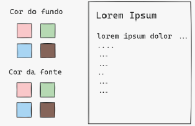
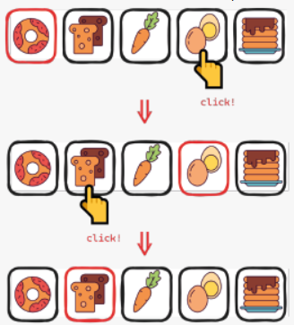
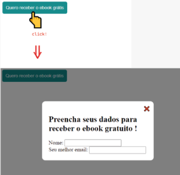

# Lista de exercício da Aula 01 - Tópicos, DOM, Condicionais do Módulo de JS

## Q1
Joãozinho fez uma página com um input e um botão. Ao clicar no botão, ele queria mostrar num alerta o texto digitado no input. Então Joãozinho escreveu o seguinte javascript:
```js
const inputValue = document.querySelector("input").value;
const button = document.querySelector("button");

function printText() {
  alert(inputValue);
}

button.addEventListener("click", printText);
```
Mas a página não está funcionando como Joãozinho queria. Explique por que não, e como seria o correto.

**Resposta**

O código do Joãozinho captura o .value (o texto) no exato momento que a página carrega. Nesse momento, o input está vazio. Quando ele clica no botão, o alert mostra aquela variável antiga (vazia), e não o que foi digitado depois. Devemos capturar o elemento input fora, mas capturar o valor (.value) apenas dentro da função, no momento do clique.
```js
const inputElement = document.querySelector("input");
const button = document.querySelector("button");

function printText() {
    const text = inputElement.value; // Captura o valor no clique
    alert(text);
}

button.addEventListener("click", printText);
```

---
## Q2
Faça uma página que tem, do lado esquerdo, um seletor de cores, e do lado direito, uma área com título e texto quaisquer:
Ao clicar numa das cores para o fundo, o documento do lado direito deve alterar a cor de fundo.



E o mesmo para o seletor da cor da fonte.

**Resposta**

Link da resposta: [Arquivo js](./Conjunto_exercicios/Exercicio_2/index.js)

---
## Q3
Faça uma página web de seleção de lanche. Quando a página abre, o primeiro lanche está pré-selecionado. Ao clicar em outro lanche, o lanche que estava selecionado é desmarcado, e no lugar dele fica marcado o lanche que foi clicado:



**Resposta**

Link da resposta: [Arquivo js](./Conjunto_exercicios/Exercicio_3/index.js)

---
## Q4
Vamos fazer uma janela modal (janela “por cima” da página). Faça a seguinte página:



**Resposta**

Link da resposta: [Arquivo js](./Conjunto_exercicios/Exercicio_4/index.js)

---
## Q5
Faça uma página web com dois botões: um contendo a imagem de uma bomba de encher pneu, e outro contendo a imagem de um pneu murcho. O botão do pneu não faz nada ao ser clicado. Por outro lado, quando o botão da bomba é clicado, ele troca a imagem do outro botão para um pneu cheio. Agora, ao clicar no botão do pneu, ele mostra um alerta dizendo “VROOM !”. Em outras palavras, o botão do pneu não fazia nada antes de clicar no botão da bomba, mas muda de comportamento após clicar no botão da bomba.

**Resposta**

Link da resposta: [Arquivo js](./Conjunto_exercicios/Exercicio_5/index.js)

---
## Q6
Faça uma página que contenha um input e um botão “adicionar”, e embaixo disso uma ul inicialmente vazia.Ao digitar uma tarefa (ex: “Lavar a Louça”) no input e clicar no botão, a tarefa é adicionada à lista. Antes de adicionar à lista, o texto da tarefa deve ser convertido para letras minúsculas, e devem ser removidos espaços-em-branco no início e no final da tarefa digitada. Por exemplo:
- " Lavar a Louça   " ⇒ "lavar a louça"

**Resposta**

Link da resposta: [Arquivo js](./Conjunto_exercicios/Exercicio_6/index.js)

---
## Q7
Faça um botão que conta quantas vezes ele foi clicado. No início, o botão tem escrito “Clique em mim !”. Ao clicar, ele muda para “Clicou 1 vez” (no singular). Ao clicar de novo, ele muda para “Clicou 2 vezes” (plural). Clicando mais vezes, ele vai aumentando a contagem, até o 10º clique: “Clicou 10 vezes”. Ao clicar pela 11ª vez, ele muda para “Ainda não enjoou ?”. E continua com esse texto mesmo clicando mais vezes.

**Resposta**

Link da resposta: [Arquivo js](./Conjunto_exercicios/Exercicio_7/index.js)

---
## Q8
Num certo jogo, o usuário tenta digitar um número premiado. Os números premiados são 0, 4, e 7. O código abaixo (que não funciona direito) tem a intenção de parabenizar o usuário se ele digitar um dos números premiados:
```js
const number = Number(prompt("Digite um número: "));

if (number === 0 || 4 || 7) {
  alert("Parabéns, você acertou!");
} else {
  alert("Você não acertou");
}
```
Qual o problema desse código? É um Erro de Execução, um Erro de Sintaxe, ou um Erro Lógico? Como seria o código correto?

**Resposta**

É um erro lógico a condição `if (number === 0 || 4 || 7)` é avaliada pelo JavaScript assim:
- `number === 0` Pode ser True ou False
- `|| 4` -> O número 4 é verdadeiro em JS.
- Portanto, a condição sempre será verdadeira, não importa o número digitado.

O código correto seria:
```js 
// Precisamos comparar a variável com CADA número explicitamente
if (number === 0 || number === 4 || number === 7) {
    alert("Parabéns, você acertou!");
} else {
    alert("Você não acertou");
}
// Ou usando array (mais elegante):
// if ([0, 4, 7].includes(number)) { ... }
```

---
## Q9
Crie uma página web que possibilite:
- A inserção de um valor mínimo inteiro maior ou igual a zero (input com type=“text”)
- A inserção de um valor máximo inteiro maior ou igual a zero (input com type=“text”)
- Clicar em um botão de sortear que ao ser clicado, exiba na página um valor inteiro entre o mínimo e o máximo (inclusive) colocados pelo usuário.
- Observação: verificar se os dados colocados são numéricos e, caso não sejam numéricos, informe ao usuário (na página, não alerta) que os valores inseridos não são numéricos.

Verificar também que são inteiros maiores ou iguais a zero (pesquise como verificar se é inteiro). Caso contrário, informe o erro.
Verificar também se o valor mínimo é menor que o valor máximo e, caso não seja, exiba uma mensagem de erro.
Somente se tudo estiver correto, deve ser sorteado um número como pedido.
A biblioteca Math é útil para sortear números. Mas ela só sorteia entre 0 e 1. Você precisará adaptar para sortear entre um mínimo e um máximo arbitrários, e ainda que seja inteiro.

**Resposta**

Link da resposta: [Arquivo js](./Conjunto_exercicios/Exercicio_9/index.js)

---
## Q10
Faça uma página web que tenha um input do tipo “text” e um botão. Ao clicar no botão, a página deve validar se o valor digitado no input é um telefone com formato “(XX) XXXX-XXXX” ou “(XX) XXXXX-XXXX”. Se for válido, a página exibe na página uma mensagem “telefone aceito”. Caso contrário, imprime na página “Não é um telefone válido”. Use Expressão Regular (pesquise).

**Resposta**

Link da resposta: [Arquivo js](./Conjunto_exercicios/Exercicio_10/index.js)

---
