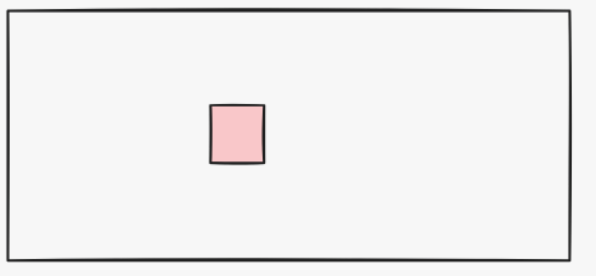
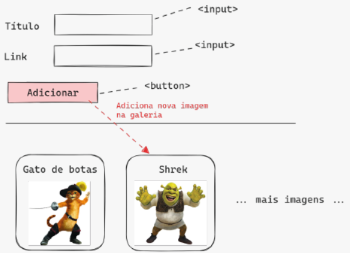
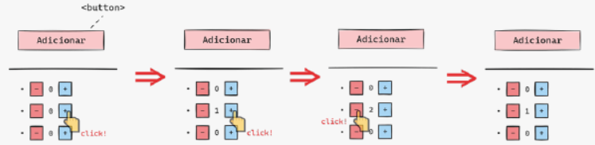

# Lista de exercícios da Aula 02 - Mapeamento, Date e Manipulação de DOM do Módulo de JS

## Q1
Considere o seguinte código (não tem sentido, é um código maluco mesmo):
```js
const obj = {
  2: 3,
  "a b c": 2,
  "!@#": true,
  42: 2,
};
console.log(obj[obj[obj["a b c"] + 40]]);
```
Esse código imprime 3 no console. Por quê ? Mostre o passo a passo da execução da última linha do código.


**Resposta**


---
## Q2
Utilize a estrutura ```switch``` e crie uma página web que contenha um formulário que possibilite:
- A inserção de um valor inteiro de 0 a 10;
- Clicar em um botão e exibir o valor de forma textual, ou seja, “um”, “dois”, “três”, …, “dez”.
Depois faça uma versão alternativa da página, que não usa ```switch```, mas sim um objeto para fazer o mapeamento.

**Resposta**


---
## Q3
Faça a seguinte página web:


Quando o usuário insere o nome do produto e a imagem (um link para uma imagem da internet) e clica em “Cadastrar”, o produto é cadastrado e passa a constar como uma das opções do `<select>` (uma nova `<option>` mostrando o nome do produto). Assim o usuário pode cadastrar vários produtos, e eles serão opções no `<select>`. Quando o usuário seleciona um produto no `<select>` e clica em “Exibir”, aparece embaixo o nome do produto e a imagem dele (a imagem mesmo, não o link).

Use um único objeto para fazer o cadastro dos produtos.

**Resposta**


---
## Q4
Considere o código abaixo, que é uma aplicação simples de lista de tarefas:
```html 
<html>
  <head></head>
  <body>
    Tarefa: <input id="input-task" />
    <br />
    <button id="add-button">Adicionar</button>
    <ul id="task-list"></ul>

    <script>
      const taskListUl = document.getElementById("task-list");
      const inputTask = document.getElementById("input-task");

      document
        .getElementById("add-button")
        .addEventListener("click", function () {
          const task = inputTask.value;
          inputTask.value = "";

          taskListUl.innerHTML += `<li>${task}</li>`;
        });
    </script>
  </body>
</html>
```
Quando o usuário digita uma tarefa no input e clica em “Adicionar”, ela é adiciona na lista, e o input é limpado. Mas tem um problema de usabilidade: normalmente esperamos que, ao digitar a tarefa e apertar Enter, a tarefa também seria adicionada na lista (sem necessidade de pegar o mouse e clicar no botão). Mas da maneira como está, apertar Enter não faz nada. Para melhorar isso, você deve alterar o HTML e o javascript:
- No HTML, deve usar um `<form>` em volta do `<input>` e `<button>` (isso basta para funcionar o Enter).
- E no javascript deve mudar o que for necessário para funcionar (obs: o `<form>` pode causar o recarregamento da página, você deve evitar isso).

**Resposta**


---
## Q5
**Desafio ! Lógica difícil ! Trabalhoso !**

Faça uma página que tem uma div com borda preta e dentro dela uma div pequena colorida:



Quando a div pequena é clicada, ela troca de cor, digamos que ela ficou “ativa”. Enquanto ela está ativa, caso você aperte uma seta direcional do teclado (esquerda, baixo, direta, cima), a div pequena se move na direção que você apertou (pode ser um passo de ~10px, não importa exatamente). Se você estiver segurando Shift quando apertar numa seta, o passo deve ser maior que o normal (~100px). Mas caso um passo da div pequena a faria sair (total ou parcialmente) da borda da div externa, o passo não é dado em todo seu deslocamento, mas somente até a borda. Quando você clica fora da div pequena, ela deixa de estar “ativa” e volta à cor original. Enquanto ela não está ativa, apertar as setas do teclado não causa movimentação. Sugestão: para saber a posição e tamanho de um elemento, pesquise sobre as propriedades offsetLeft, offsetTop, clientWidth, clientHeight. **Bônus**: depois de fazer o exercício como descrito, faça ele funcionar com 5 divs pequenas independentes sem adicionar nenhuma nova função no seu código. Sugestão: activeMovable = this dentro de um ouvinte de evento de clique, onde activeMovable é uma variável global.

**Resposta**


---
## Q6
**Desafio ! Lógica ainda mais difícil ! Ainda mais trabalhoso !**

Refaça o exercício anterior (versão básica, não bônus), mas agora a div pequena é movimentada clicando e arrastando com o mouse, não mais com as setas do teclado. Ou seja, ao clicar e segurar, a div pequena fica “ativa” (muda de cor) e passa a seguir a posição do mouse. Ao soltar o mouse, ela fica “inativa” de novo, ou seja, volta à cor original e fica parada onde o mouse soltou. Se, ao arrastar a div pequena, o mouse sair da borda da div externa, a div pequena não deve continuar, ele deve ficar “bloqueada” na parede. Mas a div pequena ainda está “ativa” enquanto o mouse estiver sendo segurado, ou seja, se você continuar segurando o mouse e voltar a posicioná-lo dentro das bordas da div externa, a div pequena imediatamente volta a acompanhar a posição do mouse. Sugestão: quando “mousedown”, registre a posição do mouse. Quando “mousemove”, calcule o deslocamento do mouse e aplique na div. Já quando o mouse sair para fora do container, pense aí ! **Bônus**: depois de fazer o exercício como descrito, faça ele funcionar com 5 divs pequenas independentes sem adicionar nenhuma nova função no seu código.

**Resposta**


---
## Q7
Vamos fazer uma galeria de imagens. A página terá dois inputs: um para o título da imagem, outro para o link (URL) da imagem. O usuário preenche esses inputs e clica num botão “Adicionar”. Embaixo da região dos inputs, há uma <div> com display: flex inicialmente sem conteúdo. Ao clicar no botão adicionar, surge um novo “card” dentro dessa div mostrando o título da imagem e a imagem em si:



Ao clicar no card de uma imagem, o card é removido da lista (desaparece).

**Resposta**


---
## Q8
Considere o código javascript abaixo, extraído de uma certa página web onde há um `<button>` e uma `<ul>`:
```js
const ul = document.querySelector("ul");

document.querySelector("button").addEventListener("click", function () {
  let count = 0;

  const li = document.createElement("li");
  li.style.display = "flex";

  const buttonMinus = document.createElement("button");
  const buttonPlus = document.createElement("button");

  buttonMinus.innerText = "-";
  buttonPlus.innerText = "+";

  const span = document.createElement("span");
  span.innerText = "0";

  li.appendChild(buttonMinus);
  li.appendChild(span);
  li.appendChild(buttonPlus);

  ul.appendChild(li);
});
```
Esse código está incompleto. A intenção dele é fazer uma página que funciona como a imagem abaixo:



**Resposta**


--- 