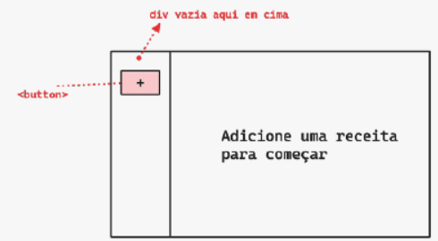
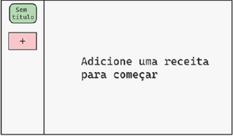
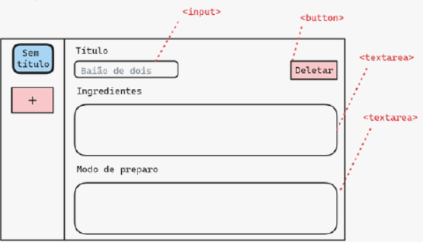
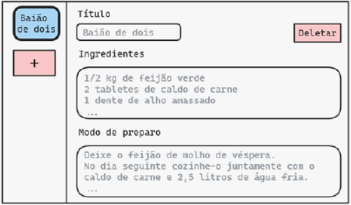
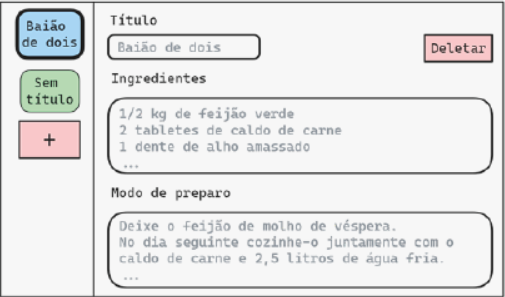
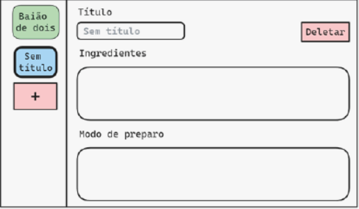
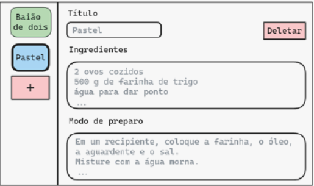
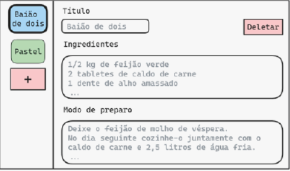
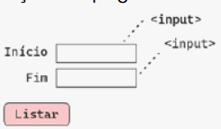

# Lista de exercícios da Aula 03 - Local Storage, Arrays e Loops do Módulo de JS

## Q1
Vamos fazer uma página para anotação de lembretes associados a um dia do ano. A página terá:
- Um `<input type="text">` para digitar um lembrete
- Um `<input type="date">` para selecionar a data do lembrete
- Um botão “Adicionar”
- Um botão “Mostrar lembretes de hoje”

O fluxo de uso dessa aplicação é o seguinte:
Primeiro o usuário adiciona um lembrete associado a um certo dia do ano. Quando clicar no botão “Mostrar lembretes de hoje”, a aplicação mostra na página os lembretes que foram adicionados para o dia de hoje. Os lembretes não devem ser perdidos mesmo que a página seja fechada. Por exemplo, se o usuário adicionar um lembrete marcado para amanhã e fechar o navegador, e amanhã reabrir o site e clicar em “Mostrar lembretes de hoje”, deve ser exibido o lembrete que havia sido adicionado no dia anterior. Se mais de um lembrete for adicionado para o mesmo dia, você deve mostrar todos eles na página. Sugestão: armazene todos os lembretes no dia numa única string, separando os lembretes entre si por um caractere de quebra de linha \n. Se não houver lembretes para o dia de hoje, o botão “Mostrar lembretes de hoje” deve mostrar a mensagem “Não há lembretes para hoje”.

**Resposta**    

---
## Q2
Vamos fazer uma página para registrar receitas culinárias. Para simplificar, a página não terá salvamento automático (ou seja, não usaremos Local Storage). Ao abrir, a página estará assim:

Ao clicar no “+”, é inserido (dentro da 
 indicada) um card com os dizeres “Sem Título” (ele representa uma nova receita, cursor pointer quando passa o mouse):

Ao clicar nesse card, é ativado o modo de “edição da receita”, onde o card muda de estilização para dar a impressão de que está ativo, e aparece no lado direito da página:
- Um input para o título, inicialmente com o valor “Sem título”, igual ao card.
- Uma textarea para os ingredientes.
- Uma textarea para o modo de preparo.
- Um botão para deletar a receita.

Ou seja, ao clicar fica assim:

O usuário pode então editar os campos. Ao editar o campo de título, o texto do card à esquerda deve mudar automaticamente para refletir o novo título. Por exemplo:

Para adicionar uma nova receita, o usuário clica no botão “+” de novo. Vai aparecer outro card embaixo do primeiro, escrito “Sem Título”, mas o usuário continuará no modo de edição da receita atual (não muda sozinho para a nova receita):

O usuário pode clicar várias vezes no botão “+”, isso vai adicionar vários cards. Quando o usuário quiser, ele pode sair da edição da receita atual e ir editar outra receita, para isso ele clica no card de outra receita, fica assim:

Agora o usuário está no modo de edição da segunda receita, então qualquer edição nos inputs e textareas será salva nesta receita (se ele não mudar nada, a receita fica como está):

Se o usuário clicar no card de uma outra receita, ele vai para o modo de edição daquela receita, e as informações dela serão preenchidas automaticamente nos inputs e textareas:

Ao clicar no botão de deletar, a receita atual é deletada, isso faz o card dela desaparecer, e o modo de edição se fecha:

A partir daí, o usuário pode clicar no botão de “+” para adicionar uma nova receita (novo card é sempre adicionado no final da lista, adicionar um card não abre o modo de edição), ou clicar no card de alguma receita para começar a editá-la (isso abre o modo de edição se estiver fechado).

Sugestões/dicas:
- Array global para receitas (um array de objetos).
- Nos cards, guarde uma propriedade customizada data-index contendo o índice daquela receita no array de receitas.
- Tenha uma variável global currentRecipeIndex contendo o índice da receita que está sendo editada atualmente.
- Ao deletar uma receita, o card vai sumir e a receita será retirada do array de receitas, então os índices das receitas seguintes a ela serão reduzidos em uma unidade. Use querySelectorAll e um loop (com condicional dentro) para corrigir as propriedades data-index somente dos cards posteriores à receita que foi deletada.
- Note que, se atualmente há X receitas no array e for criada uma nova receita, o índice dela será X.
- É possível encontrar um objeto DOM que tem data-index="1" (ou outro número) fazendo document.querySelector('[data-index="1"]');
- Mostre ou esconda o formulário de edição usando um display: none.

**Resposta**

---
## Q3
Faça uma página web contendo o seguinte formulário:

Ao clicar no botão Listar, valide que ambos os inputs são numéricos e inteiros, e o número “Início” é menor que o número “Fim” (caso contrário exiba uma mensagem de erro e não faça mais nada). Se a validação passar, exiba na página uma `<ul>` , e dentro dela, um `<li>` para cada número entre o número “Início” (inclusive) e o número “Fim” (exclusive, ou seja, pare 1 antes do Fim). Note que não precisa de array para fazer isso.

**Resposta**

---
## Q4
Faça uma página web que tem uma textarea onde o usuário deve colar uma lista de nomes separados por vírgulas, por exemplo “João,Maria,José,Ana”. A página deve ter um botão “Listar” que, quando clicado, mostra uma `<table>` com duas colunas. A coluna da esquerda tem título “Índice” e a da direita tem título “Nome”. Em cada linha da tabela, na coluna da direita deve aparecer um dos nomes digitados (na ordem em aparecem na textarea) e na da esquerda deve aparecer o índice dele começando em 0. Para o exemplo dado, a tabela seria como segue: 

Sugestão: pesquise sobre o método de string chamado split(), ele permite quebrar uma string em um array de strings (por exemplo quebrar nos pontos onde aparece a vírgula)

**Resposta**

---
## Q5
Faça uma página web com um botão “Sortear”. Ao clicar nesse botão, a página deve sortear aleatoriamente 6 números inteiros distintos entre 1 e 30 e armazená-los num array, mas não deve exibir esse array para o usuário. Se clicar no “Sortear” de novo, a página faz outro sorteio (reconstrói o array). A página deve ter também um input numérico e um botão “Chutar”. Ao digitar um número no input e clicar em “Chutar”, a página deve mostrar uma mensagem dizendo se usuário acertou algum dos números sorteados ou não.

**Resposta**

---
## Q6
Crie uma página web que peça ao usuário que digite um nome de produto, sua descrição e seu respectivo valor e que possua um botão de “Incluir produto”. 

Caso o usuário preencha um nome de produto, sua descrição e valor válidos e clique no botão “Incluir produto”, deve ser criado um objeto do produto (com as propriedades id, nome, descricao, valor) que será incluído em um array de produtos, e deve ser mostrada uma mensagem do tipo `Produto ${produto.nome} incluído com sucesso!`.

O id do objeto produto deve ser um timestamp.

Caso o usuário preencha algum dado incorreto (condições de validação de nome, descrição e valor, que não podem estar vazios e o valor deve ser positivo) e clique no botão “Incluir produto”, deverá ser mostrada uma mensagem do tipo “Falha no cadastro do produto!” e, se possível, o motivo da falha na inclusão do produto (onde houve o erro ?).

Quando um produto é incluído com sucesso, ele deve aparecer numa `<table>` que fica embaixo do formulário de inclusão.

A tabela deve conter 4 colunas: Nome, Valor, Editar e Apagar (note que não tem uma coluna para a descrição nem para o ID do produto).

Cada linha da tabela deve ter o nome do produto, seu valor, uma imagem pequena (ícone) que representa um botão de editar e uma imagem pequena (ícone) que representa um botão de apagar.

Caso o usuário clique no nome do produto, deve ser aberta uma janela modal onde são exibidos todos os dados do produto (tudo que já aparece na tabela, e também o ID e a descrição). A janela deve poder ser fechada.

Caso o usuário clique no ícone de editar da linha do produto, deve ser aberta uma janela modal contendo um formulário para editar todos os dados do produto (com exceção do ID) e um botão “Salvar”. Quando a janela se abre, os inputs devem ser automaticamente preenchidos com os dados atuais do produto. Ao editar os inputs e clicar em Salvar, a janela se fecha e atualiza o produto no array e na tabela.

Caso o ícone da lixeira do produto na tabela seja clicada, deve-se apagar o produto do array de produtos e da tabela.

O array de produtos deve ser salvo no Local Storage. Ao recarregar a página, a tabela deve ser preenchida com os dados recuperados do Local Storage. Ao usar o aplicativo, qualquer produto que seja incluído, editado ou apagado deve causar um salvamento no Local Storage para que a modificação não seja perdida.

**Resposta**

---